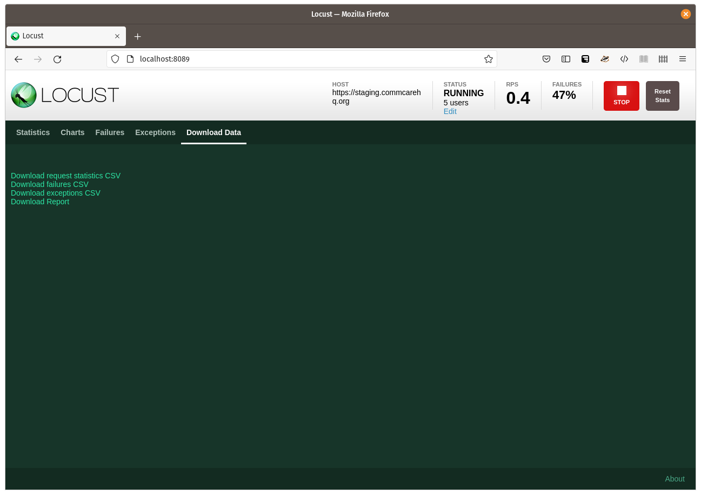

Performance Benchmarking for CommCare HQ using Locust
=====================================================

Installing Locust and commcare-perf
-----------------------------------

For nearly all situations, running locally should be sufficient for
making hundreds, or even thousands, of requests per second::

    $ git clone https://github.com/dimagi/commcare-perf.git
    $ cd commcare-perf
    $ python3 -m venv venv && source venv/bin/activate
    (venv) $ pip install -r requirements.txt

See `README <https://github.com/dimagi/commcare-perf/blob/main/README.rst>`_
for configuring environment variables.

See Locust documentation for `running in Docker <https://docs.locust.io/en/stable/running-locust-docker.html>`_.

Getting started
---------------

1. Start Locust with a web interface::

       (venv) $ locust -f locustfiles/form_submission.py

2. Open http://localhost:8089 in a browser.

3. You will be asked the number of users to simulate, and their spawn
   rate. Start with 1 user, at a spawn rate of 1 user per second, and
   click the "Start swarming" button.

4. Locust will show you a table of statistics. You can switch to the
   "Charts" tab to see requests per second, response times, and the
   number of simulated users.

   .. image:: locust_statistics.png
      :alt: Locust statistics

5. Click "Stop" and increase the number of users to see how CommCare is
   affected.

Extending the script
--------------------

At the time of writing, the script ``locustfiles/form_submission.py``
uses a very small form for testing; it has only two, empty questions.
The form is defined at the end of the file:

.. code:: python

    xform = """<?xml version='1.0' ?>
    <data xmlns:jrm="http://dev.commcarehq.org/jr/xforms"
          xmlns="https://www.commcarehq.org/test/LocustPerfTesting/">
        <foo/>
        <bar/>
        <meta>
            <deviceID>LocustPerfTesting</deviceID>
            <timeStart>2011-10-01T15:25:18.404-04</timeStart>
            <timeEnd>2011-10-01T15:26:29.551-04</timeEnd>
            <username>admin</username>
            <userID>testy.mctestface</userID>
            <instanceID>{instance_id}</instanceID>
        </meta>
    </data>
    """

If you would like to use a real form submission, you can find one in
CommCare.

1. Navigate to "Reports" > "Case List", and find a sample case with test
   data. (Do not use a real case, because we will be submitting test
   data to it.)

2. Select the case, and choose the "Case History" tab.

3. Select a form. (If you select the form that registered the case, you
   will get duplicate cases.)

4. Choose "Raw XML".

5. Copy and paste the XML into ``locustfiles/form_submission.py``,
   replacing the current form.

6. Find the ``<n1:instanceID>`` tag, and replace its value with
   ``{instance_id}``. The result should look like::

       <n1:instanceID>{instance_id}</n1:instanceID>

7. If the form registers a case, find the tag that sets the case ID. It
   starts ``<n0:case case_id="...``. Change the case ID to
   ``{case_id}``. The result should look like::

       <n0:case case_id="{case_id}" date_modified="...

   Skip this step if the form updates an existing case but does not
   register a case.

8. Save the file, and restart Locust to test using your form submission.

Saving results
--------------

In Locust, switch to the "Download Data" tab.

Here you can download the report, and various data in CSV format.

